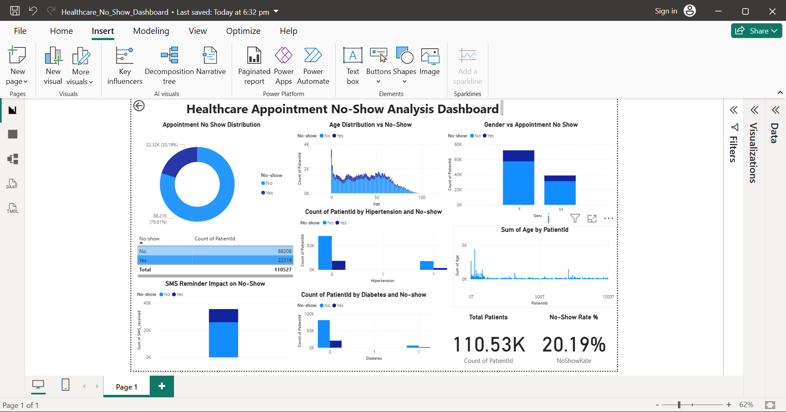

\# Healthcare Appointment No-Show Analysis

\## Introduction

This project analyzes healthcare appointment data to understand patterns behind patient no-shows. The analysis identifies factors such as age, gender, medical conditions, and SMS reminders that influence appointment attendance.

\## Tools Used

Python, Pandas, Seaborn, Matplotlib, Scikit-Learn, SQL, Power BI

\## Dataset

The dataset contains patient appointment records including age, gender, SMS reminders, medical conditions, and whether the patient attended the appointment.

\## Analysis

Exploratory Data Analysis was performed to study:

\- Age distribution of patients

\- Gender vs no-show

\- Impact of SMS reminders

\- Effect of medical conditions

\## Machine Learning

A Decision Tree Classifier was used to predict whether a patient is likely to miss their appointment.

\## Power BI Dashboard

An interactive dashboard was created to visualize:

\- No-show distribution

\- Age vs no-show

\- Gender vs no-show

\- Hypertension \& Diabetes impact

\- SMS reminder impact

\- Total Patients KPI

\- No-Show Rate KPI

\## Dashboard Preview

!\[Dashboard](dashboard.png)

\## Key Insights

\- Many patients miss their appointments.

\- Younger patients miss appointments more frequently.

\- SMS reminders reduce missed appointments.

\- Some medical conditions influence attendance.

\## Conclusion

Hospitals can use these insights to improve scheduling systems and reduce missed appointments.

&nbsp;           

